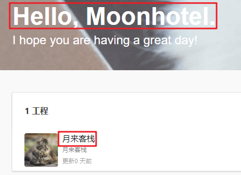

<div align="center">
  
<h4 align = "center">
 <a href="https://github.com/doccano/doccano">原项目Github地址 </a>  
  </h4>
    <h3 align = "center">doccano中文使用指南</h3>
</div>


# 1 doccano

doccano是一个面向人类的开源文本注释工具。它为文本分类、序列标记和序列到序列任务提供标注功能。因此，您可以为情感分析、命名实体识别、文本摘要等创建标记数据集。现在，你只需创建一个项目，上传数据并开始注释，在数小时内就能完成数据集的构建。

## 2 演示

你可以点击这里查看演示项目 [点击](http://121.4.212.150:8000/).

关注公众号“月来客栈”回复doccano可获得试用账号！


## 3 安装

在接下来的内容中，笔者将对其中的Python部署方法进行介绍，对于期间可能遇到的问题也给出了相应的解决方案；同时，笔者也在原项目的基础上做了一点修改：①将一些每次都需要获取的js等文件部署到了本地以加快访问速度；②对整个doccano项目进行了汉化处理[3]。因此，下面你既可以下载笔者修改后的项目文件，也可以下载原来的工程文件。

### 3.1 安装Python环境

对于该项目我们首先需要一个Python3.6的环境。如果是已经安装过了`conda`，那么只需要下面一条命令即可完成python环境的安装。

```shell
conda create -n docc python=3.6
```

如果没有`conda`环境，请参见**这篇文章**进行安装。

**注意：务必建立一个python3.6版本的虚拟环境，因为以下Python依赖包都必须建立在此基础上。**

### 3.2 安装Python依赖包

- 下载doccano工程文件

  首先，我们需要下载doccano项目文件，下面两个工程文件，下载其中一个到本地即可。

  ```shell
  #原始项目文件
  git clone https://github.com/doccano/doccano.git
  
  # 笔者汉化后的项目文件
  git clone https://github.com/moon-hotel/doccano.git
  ```

- 安装Python依赖包

  下载完成后进入目录`doccano/app`中安装Python依赖包，如果出现443的网络错误，重新运行即可。

  ```shell
  pip install -r requirements.txt -i https://pypi.tuna.tsinghua.edu.cn/simple
  ```

  此时，不出意外会有如下报错信息：

  ```shell
  Error: pg_config executable not found.
  pg_config is required to build psycopg2 from source.  Please add the directory
      containing pg_config to the $PATH or specify the full executable path with the
      option:
  ```

  解决方法，以root身份运行如下命令：

  ```shell
  sudo apt-get update #更新软件源
  sudo apt-get install libpq-dev gcc
  ```

  安装完成后重新运行上面的python包安装命令。但如果不出意外的话，还会有下面这个错误提示：

  ```shell
  #include <sql.h>
                ^~~~~~~
      compilation terminated.
      error: command 'gcc' failed with exit status 1
  ```

  解决方法，以root身份运行如下命令：

  ```shell
  sudo apt-get install unixodbc unixodbc-dev
  ```

  安装完成后继续运行上面的python包安装命令。如果还出现了如下错误提示：

  ```shell
  while (interp->next)
  It appears you are missing some prerequisite to build the package from source.
  error: command 'gcc' failed with exit status 1
  ```

  那请赶快换成python3.6的环境。

到此为止，我们就把需要的python依赖包给安装完成了，比较多估计得有近百个。如果你还出现了其它错误，请自行搜索相关错误提示。接下来，下一步就是配置安装前端的相关依赖环境了。

### 3.3 配置前端环境

- 以管理员身份安装`npm`

  ```shell
  sudo apt-get install npm
  ```

- 安装相关依赖包

  切换到如下目录：	

  ```
  doccano/app/server/static
  ```

  然后运行命令：

  ```shell
  npm install 
  ```

  接着安装结束后就会看到如下的提示信息[3] [4]

  ```shell
  loadDep:fsevents → 304    ▌ ╢████████████████████████████████████░░░░░░░░░░░░░░░░░░░░░░░░░░░░░░░░░░░░░░░░░░░░░░░░░░░╟
  WARN engine fsevents@2.1.3: wanted: {"node":"^8.16.0 || ^10.6.0 || >=11.0.0"} (current: {"node":"8.10.0","npm":"3.5.2"})
  npm WARN optional Skipping failed optional dependency /chokidar/fsevents:
  npm WARN notsup Not compatible with your operating system or architecture: fsevents@2.1.3
  ```

  注意，从最后一行可以看到此处有一个警告。虽然只是警告，但不解决却不行。

  解决方法：

  ```shell
  sudo npm install npm -g
  npm install –g n
  n latest    #(升级node.js到最新版)
  ```

  然后再次运行`npm install`，运行结束后就不会出现上面不兼容的提示了。接下来再次运行命令：

  ```shell
  npm run build
  ```

  此时就会出现如下提示：

  ```shell
  [./pages/download_speech2text.js] 221 bytes {download_speech2text} [built]
  [./pages/download_text_classification.js] 250 bytes {download_text_classification} [built]
  [./pages/guideline.js] 246 bytes {guideline} [built]
  [./pages/index.js] 774 bytes {index} [built]
  [./pages/label.js] 167 bytes {label} [built]
  [./pages/projects.js] 181 bytes {projects} [built]
  [./pages/seq2seq.js] 209 bytes {seq2seq} [built]
  [./pages/sequence_labeling.js] 287 bytes {sequence_labeling} [built]
      + 433 hidden modules
  ```

  到此，就完成了整个doccano的环境部署，接着就是启动服务。

  执行如下命令并启动服务：

### 3.4 启动服务

首先切换到目录`doccano/app`中，然后依次运行如下命令：

```shell
python manage.py migrate
python manage.py create_roles
python manage.py create_admin --noinput --username "admin" --email "admin@example.com" --password "password"
python manage.py runserver #启动服务
```

执行完成后会看到如下提示信息：

```shell
Watching for file changes with StatReloader
Performing system checks...

System check identified no issues (0 silenced).
September 21, 2020 - 11:23:37
Django version 2.2.13, using settings 'app.settings'
Starting development server at http://127.0.0.1:8000/
Quit the server with CONTROL-C.
```

到此整个工程就算是部署完成了。如果你是在自己电脑上部署的，请直接输入`127.0.0.1:8000`即可访问；如果是在服务器上部署的，输入`ip:8000`即可访问。例如笔者部署在了华为云上，输入`http://124.71.156.219:8000/`就可以进行访问。

如果出现不能访问，或者是如下错误提示：

```shell
Unable to round-trip http request to upstream: dial tcp 124.71.156.219:8000: connectex: No connection could be made because the target machine actively refused it.
```

请从如下方面入手调试：

- 服务器的网络出入规则的入口是否打开了`8000`端口；
- 在启动服务的时候再次手动指定端口；
  - `python manage.py runserver 0.0.0.0:8000`

访问成功页面：


<center>
    图 1. 访问成功页面图
</center>


## 4 使用方法

对于整个项目的功能点，笔者几乎算是都测试了一遍。对于单独的一个人进行标注的话还比较完善，但是在多人协同标注方面还有好几个bug。但由于笔者并不熟悉前端所以也就无法修复了。接下来笔者将选择性的对其中的一项功能进行介绍。

### 4.1 用户管理

#### 4.1.1 添加

手动输入地址`http://127.0.0.1:8000/admin/`进入到后台管理系统，然后点击“Add”按钮：


<center>
    图 2. 用户添加按钮
</center>


在跳转后的页面中，输入相应的用户信息后，点击页面右边的保存。


<center>
    图 3. 注册页面图
</center>


在再次跳转出的页面中，可以填入相关个人信息也可以不填，最后再点击页面最右下角的保存按钮即可完成创建。

#### 4.1.2 删除

在后台系统中，点击如图4所示的"User"，进入人员查看页面：


<center>
    图 4. 用户查看按钮图
</center>


在用户查看页面中，选择需要删除的用户，然后点击“Go”按钮即可完成用户的删除操作。


<center>
    图 5. 人员删除图
</center>

### 4.2 工程创建

#### 4.2.1 创建工程

再次回到主页面（`http://127.0.0.1:8000/`），用管理员账户登录然后创建标注工程。


<center>
    图 6. 登录图
</center>


登录后点击“创建工程“按钮，并填入相关信息（此处以序列标注的任务为例，其它任务类似）：


<center>
    图 7. 工程创建图
</center>


其中，打乱样本顺序的作用是使得每个标注员分配到的样本数量相同，但是标注时出现的顺序不同；共享标注结果的作用是使得每个标注员标注的结果可以共享，并且以最后依次的标注结果作为最终样本的标注结果。勾选完成后点击”创建“按钮即可完成工程的创建。

#### 4.2.1工程管理

在完成工程创建后就会跳转到如图8所示的页面：


<center>
    图 8. 工程管理页面
</center>


下面笔者只对导入数据和人员管理两个模块儿进行介绍，其它的模块点进入就知道怎么设置的了。

- 导入数据

  点击图8上面的”导入数据“按钮即可来到原始数据的导入界面（其实就是图8这个页面）。选择Plain（`.txt`）格式，然后点击”选择文件“上传需要进行标注的语料。需要注意的是在`.txt`的文本中，每一行就视为标注过程中的一个样本，同时不能出现空白行，不然会报错无法上传。

  在完成原始数据的上传后，就能在”数据管理“中看到上传后的数据，并且点击样本右边对应的删除按钮还可以对部分样本进行删除：


<center>
    图 9. 数据管理图
</center>


- 人员管理

  点击图8中的”人员管理“按钮进入到标注工程的人员管理页面中。

  

  <center>
      图 10. 人员管理图
  </center>


  如图10所示，点击左上角的”添加标注人员“按钮就能为该工程添加其他标注人员。在图10中上面部分，只能选择已存在的用户为某个标注工程的标注人员（也就是先要按照3.1.1小节中的方法添加账户）。在这里我们选择添加前面创建的'moonhotel'用户为该项目的标注人员之一，在选择完权限分配后点击右边的添加即可。

  同时，对于每个标注人员来说都有三种权限可供分配，其权限对应的功能如下：

  - project_admin：项目管理员，可以对整个标注工程进行管理，即有如图8所示的管理功能；
  - annotator：普通标注人员，无任何查看与编辑权限只可以对数据进行标注；
  - annotation_approver：普通标注人员，只比annotator多了审阅标注的功能（多人协同标注时）；

  在这里，我们将账户'moonhotel'设置为annotation_approver。按照同样的方法，我们可以按需要为标注工程创建更多不同权限下的标注人员。

### 4.3 数据标注

在完成好前面的所有设置后，不同的标注人员就可以通过自己的账号登录到系统中了。



<center>
    图 11. 标注人员登录图
</center>


如图11所示，我们以账户'Moonhotel'登录后就能够看到自己被分配到的标注工程”月来客栈“中。点击工程名即可进入到标注页面（第一次点击会下载原始数据，所有要等一下）：


<center>
    图 12. 标注页面图
</center>


如图12所示就是标注的页面，对于被标注过的样本，左边对应样本前面就会有一个勾的状态；同时，标注的方法就是先选择需要标注的文本片段，然后选择上面的标签即可。

### 4.4 结果导出

当工程标注完成后，项目管理员（或者是系统管理员admin）就可以登录到后台对标注好的数据进行导出操作。


<center>
    图 12. 工程查看图
</center>


如图12所示，项目管理员登录到系统后点击编辑按钮回到图8所示的工程管理界面。然后点击导出数据，选择需要的格式导出即可。


<center>
    图 13. 数据导出图
</center>


如下所示就是导出后的结果，可以根据自己的需要通过python来进行提取。

```shell
{"id": 13, "text": "doccano是一个面向人类的开源文本标注工具。它为文本分类、序列标记和序列到序列任务提供注释功能。因此，您可以为情感分析、命名实体识别、文本摘要等创建标注数据。", "meta": {}, "annotation_approver": null, "labels": [[0, 7, "名词"], [12, 15, "形容词"], [19, 23, "名词"], [26, 30, "名词"], [62, 68, "名词"], [57, 61, "名词"], [69, 73, "名词"]]}
```

### 4.5 重置密码

由于Doccano的后台管理系统是基于Django框架的，所以如果你不小心忘记了管理员（admin）的密码，那么你可以按照如下方法来进行重置。

- 进入`./app`目录，并执行`python manage.py shell`命令

- 然后输入以下代码进行重置

  ```python
  from django.contrib.auth.models import User
  user = User.objects.get(username='admin')
  user.set_password('这里输入admin的新密码')
  user.save()
  ```

- 然后以新密码重新登录即可。

## 5 引用

```tex
@misc{doccano,
  title={{doccano}: Text Annotation Tool for Human},
  url={https://github.com/doccano/doccano},
  note={Software available from https://github.com/doccano/doccano},
  author={
    Hiroki Nakayama and
    Takahiro Kubo and
    Junya Kamura and
    Yasufumi Taniguchi and
    Xu Liang},
  year={2018},
}
```

## 6 帮助

如果你按照上述步骤依旧无法部署成功，那么可以搜索笔者微信`nulls8`添加好友进行咨询。